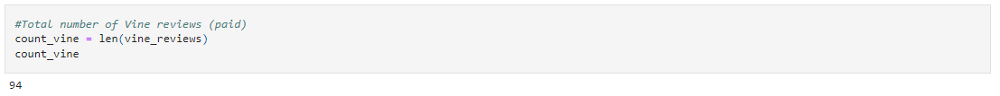
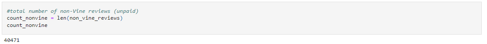
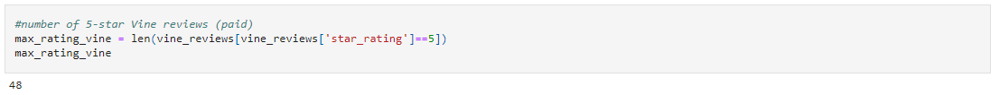
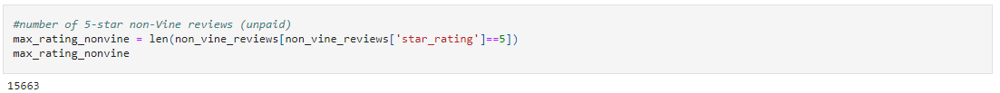
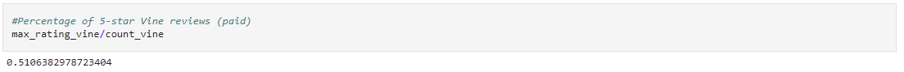
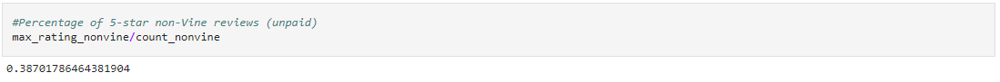

# Amazon_Vine_Analysis

## Project Overview

The purpose fo this analysis is to determine if there is any bias towards favourable reviews as part of the Amazon Vine program. The Amazon Vine program is a service that allows manufacturers and publishers to receive reviews for their products. Companies like SellBy pay a small fee to Amazon and provide products to Amazon Vine members, who are then required to publish a review.

To conduct this analysis the data used was US Amazon reviews for video games which can be found at the following link.

[Video Game Amazon Reviews](https://s3.amazonaws.com/amazon-reviews-pds/tsv/amazon_reviews_us_Video_Games_v1_00.tsv.gz)

An ETL was performed on the dataset and a Postgres database was utilized to house the data in a number of tables. 

[Customer Table](https://github.com/ByronKrauskopf/Amazon_Vine_Analysis/blob/main/images/customers_table.PNG)

[Products Table](https://github.com/ByronKrauskopf/Amazon_Vine_Analysis/blob/main/images/products_table.PNG)

[Review ID Table](https://github.com/ByronKrauskopf/Amazon_Vine_Analysis/blob/main/images/review_id_table.PNG)

[Vine Table](https://github.com/ByronKrauskopf/Amazon_Vine_Analysis/blob/main/images/vine_table.PNG)

## Results

### How many Vine reviews and non-Vine reviews were there?
There were a total of 94 paid vine review and 40,471 unpaid non-Vine reviews from a review total of 40,565

### How many Vine reviews were 5 stars? How many non-Vine reviews were 5 stars?
Of the 94 Vine reviews there were a total of 48 that were rated at 5-stars. Of the 40,471 non-Vine reviews there were 15,663 5-star reviews.

### What percentage of Vine reviews were 5 stars? What percentage of non-Vine reviews were 5 stars?
The percentage of paid 5-star Vine reviews was 51.06%, while the percentage of unpaid non-vine reviews was 38.70%.

## Summary

Given that a wide variance of 12.36% exists between the percentage of 5-star video game reviews from paid and unpaid sources (51.06% vs 38.70% respectively), it is reasonable to assume that there is a positivity bias at play.

Additional analysis should be performed to further confirm this assumption. This should include:
- performing the same analysis of additional review datasets to confirm the same results exist across product categories
- analyze the statistical distribution of the reviews to determine if they are normally distributed or if there is a skew
